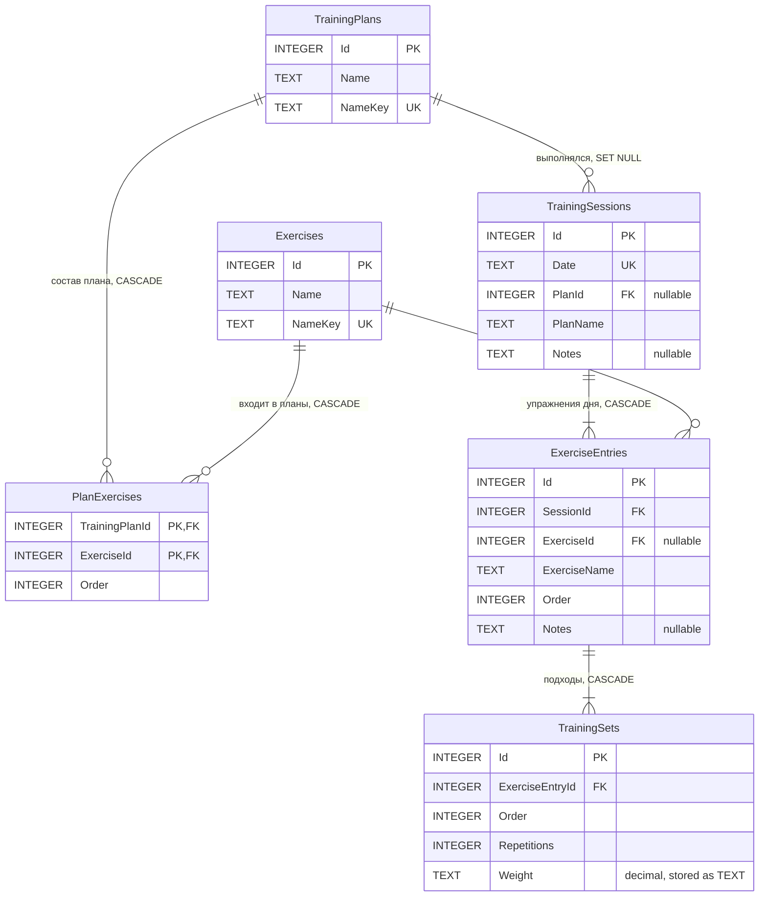

# ER-схема TrainingLog

SQLite, файл базы `%LOCALAPPDATA%\TrainingLog\exercises.db`, EF Core 10.0.12.
Шесть прикладных таблиц; подробные `CREATE TABLE`, связи и индексы — в `db-schema.md`,
локальном файле вне репозитория.

Обозначения: `PK` — первичный ключ, `FK` — внешний ключ, `UK` — уникальный индекс.
`||--o{` — «один ко многим», `||--|{` — «один ко многим, но не пустому» (у ребёнка
обязательный FK).

Рёбра помечены правилом удаления из базы. Оно одинаково выглядит по-разному в зависимости
от того, что означает удаление родителя: каскад там, где содержимое без родителя теряет
смысл, и `SET NULL` там, где удаление не должно стирать историю журнала.
